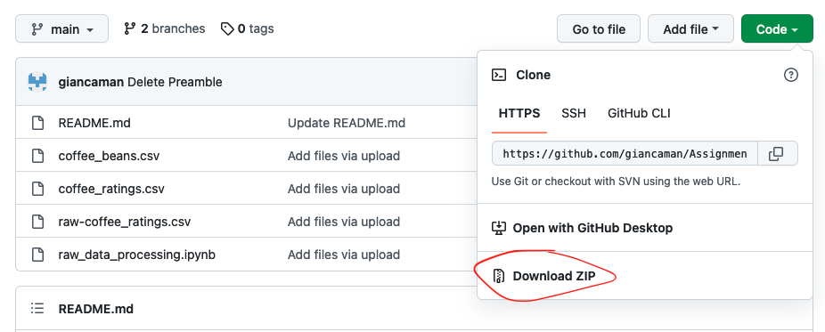

# Istruzioni dell'assignment

L'assignment (**che non è obbligatorio**) si suddivide in tre parti:

1. Manipolazione dati
2. Modellazione in Python
3. Modellazione in R

Per la parte in Python ciascuna parte deve essere eseguita su un notebook separato. Usate pure Colab (colab.research.google.com). 
Abbiate cura di specificare quale versione di Python state usando (eseguendo il comando `python --version` in una cella). 

Il punteggio massimo attribuibile è di 6 punti. Il lavoro deve essere svolto preferibilmente in maniera individuale. Se si vuole lavorare in gruppi, il punteggio finale sarà suddiviso proporzionalmente alla numerosità del gruppo. Si effettueranno controlli a campione sull'originalità del codice.

## Set up

Scaricare i file, andate sul menù a tendina sotto il bottone `Code` verde e selezionate `Download ZIP`.

## Parte 1. Manipolazione dei dati con Python

I dati forniti in input (*coffee_beans.csv* e *coffee_ratings.csv*) dovranno restare nella cartella *data-processed*.  I dati che creerete, invece, andranno in una nuova cartella di nome *data-modelling*.

Nel notebook *raw_data_processing.ipynb* trovate delle informazioni sulle variabili contenute nel dataset originario (*raw-coffee_ratings.csv*) e il codice usato per trasformare i dati grezzi in quelli dell’assignment.
L’assignment consta dei seguenti passi:
1.	Usando pandas, leggete i due dataset *coffee_beans.csv* e *coffee_ratings.csv* contenuti in *data-processed*.
2.	Unite le due tabelle usando una join/merge, usando la colonna *coffee_id* nelle due tabelle.
3.	Ispezionare il numero di valori nulli per ogni variabile e decidere se e quali righe tenere o cancellare. Giustificare la propria scelta.
4.	Creare una nuova colonna *high_quality* che abbia valore 1 se la variabile *total_cup_points* è superiore a 82.5 e 0 se è inferiore.
5.	Salvare il dataset ottenuto nella cartella *data-modelling* in con il nome *coffe.csv* in formato *.csv*.
6.	Raggruppare i dati per paese di provenienza e calcolare i valori minimi, massimi e la media di *total_cup_points*; infine, ordinarli in ordine decrescente in base alla media.
7.	Usando matplotlib o seaborn, disegnare un grafico con i paesi sull’asse x e sull’asse y la media di *total_cup_points*. Individuare i punti che esprimono il valore minimo, media e varianza, e avere cura di aggiungere titoli e nomi degli assi.

## Parte 2. Modellazione con Python: KMeans Clustering 

1. Leggere il dataset "definitivo" (*coffe.csv*) da *data-modelling*.
2. Usando *matplotlib* o *seaborn*, esplorare le relazioni tra le variabili (ad esempio usando un *pairplot*). Includete i grafici più significativi e commentateli brevemente.
3. Fittate un modello *KMeans*, avendo cura di:

    a. Scegliere le variabili da includere nell'algoritmo. Ad esempio, dai plot potreste aver trovato che alcune variabili siano più o meno importanti e quindi debbano essere escluse. Allo stesso modo, se una variabile ha categorie con una frequenza troppo bassa, potete evitare di includerla nell'algoritmo. In ogni caso, giustificate la vostra scelta. Potete fare riferimento al notebook *raw_data_processing.ipynb* per ispezionare le frequenze.

    b. Trasformare le variabili categoriche (cioè non numeriche) in *dummies*.

    c. Normalizzare i dati.

    d. Utilizzare almeno una metrica di errore tra quelle viste a lezione per identificare il numero ottimale di cluster. Giustificare brevemente la scelta.
4. Disegnare uno o più scatterplot delle variabili suddivise per cluster.

## Parte 3. Modellazione in R: Regressioni Logistiche

Per la parte di R, potete consegnare sia uno script (un file in .R) o un notebook (.Rmd) (si veda, per esempio, https://bookdown.org/yihui/rmarkdown/notebook.html).
1.	Leggere il dataset “definitivo” (*coffe.csv*) da *data-modelling*. **Nota bene: escludere la variabile *total_cup_points***.
2.	Separare il dataset in train e test set.
3.	Fittare una regressione logistica binomiale, usando come variabile dipendente *high_quality*. 
Provare più di un modello, ad esempio includendo diverse variabili e valutando con le diagnostiche fornite dal software ($R^2$, F, AIC, ecc.).

## Modalità  di consegna

Salvare i notebook, i file R, e il *.csv* dei dati manipolati in una zip da inviare per email a luca.baggi@unimi.it e in CC a giancarlo.manzi@unimi.it entro lunedì **27 giugno 2022**.

## Criteri di valutazione
Cercare di svolgere quanto più lavoro possibile. L'assignment sembra pesante ma la valutazione terrà conto del vostro attuale livello di skill nella programmazione.

I principali criteri di valutazione sono:

* Il codice deve poter essere eseguito da cima a fondo senza dare errori.
* Spiegare e commentare, anche brevemente, le cose che si fanno, alternando blocchi di codice a blocchi di testo.

A questi si aggiungono:
* Forma del codice: ad esempio quanto sono chiari i nomi delle variabili.
* Titoli ed elementi dei grafici.
